Fall 2023
Final Report
CyberTRIP

1. Introduction
CyberTRIP, short for Cyber Triage & Response Incident Platform, is a comprehensive web-based
tool designed to simplify how cybersecurity incidents are tracked, managed, and prioritized in real-time.
Motivated by the need for an integrated environment in security operations centers, this project was
meant to simplify and optimize cybersecurity incident response. It stands out by integrating external
cybersecurity tools naturally into a single, user-friendly dashboard, offering not just real-time incident
tracking and management, but also the capability to add, save, search, and easily generate statistics on
incidents. It includes all the key features of an incident response tool, while avoiding any unnecessary or
distracting extras. The platform's ability to generate incident statistics to export data in formats like CSV
further extends its utility outside the tool.

The project was conceptualized to satisfy the needs of security operations center analysts, who
required a powerful yet intuitive tool to enhance their efficiency in responding to security incidents.
Many of these tools can be overwhelming and overly complex. The uniqueness of CyberTRIP lies in its
all-in-one solution approach, where different types of incident responses can be managed and accessed
via an integrated dashboard. This ensures that digital assets remain secure while significantly
streamlining the workflow for addressing cybersecurity incidents. CyberTRIP's design also reflects an
understanding of the complexity and uniqueness of cybersecurity incident response, which comes from
one of the team member’s cybersecurity internship experience. In their experience, they found that
integrated access to a variety of tools in one interface would be desirable. With this platform, we aim to
facilitate the most common workflows that not only address basic responses but also adapt to the
evolving landscape of cybersecurity threats.

Challenges
The development of CyberTRIP faced several challenges, especially in making sure the different
parts of our program, each using distinct technologies, worked well together. Each component needed to
be carefully created to ensure they functioned smoothly as a unified system with other components. For
example, the Mongo database stored data in BSON format, while other components needed to have the
data in JSON format. 

Another of the primary challenges faced by our team was ensuring the security and
privacy of potentially sensitive data. Since this is a web application potentially accessible to people
outside of the desired user environment, we had to ensure that all the data was transmitted and stored
securely. This was not just a technical issue, but a requirement, given the nature of our program. To
address this, our team implemented security measures including encryption at rest using bcrypt to
securely store user passwords and session management using a secret key to prevent session hijacking.
We also used certificates to encrypt data in transit for https transfer, which protects it against
eavesdropping. We further implemented the Python cryptography library function to secure the data
stored in our Mongodb.

Another significant challenge was the integration of various external APIs, each with its own
unique format and authentication method. This required a careful and methodical approach, as the team
strived to create a user-friendly experience. We started with a simple API at first, urlscan, and created a
way a user could click on any link in the incident notes to trigger the urlscan API. We had a few issues
with the event listeners and the fact that the API has a built-in wait time for responses. We dealt with this
by adding a countdown timer and had the results page load in a pop up at the correct time.

The user interface had a few of its own challenges, particularly in terms of creating a design that
was both user-friendly and capable of displaying diverse types of information. We utilized some of our
member’s prior knowledge of JavaScript and MongoDB to develop an interface that was simple to
interact with. Those members primarily dealt with the front-end coding. However, we found we needed
to use some technologies that none of us were previously familiar with like Flask and Jinja. Although we
all knew Python and basic web programming, learning flask was crucial. It was necessary to learn
because it’s fundamental tool for automated handling of web sessions, requests, and responses and
routing them to our Python code so that the correct html templates can be displayed. We also discovered
that we needed to use a tool called Gunicorn to manage web requests on our AWS server.

Finally, the decision to make the platform web-based introduced issues related to development
and testing, especially with a team of four members. Hosting and scalability were additional
considerations beyond hosting our program on one development machine. The team’s decision to initially
host locally and use GitHub for version control was a good approach for initial development, allowing
for controlled testing and gradual addition of features. As the basics progressed and were found to be
working as planned, we moved to cloud services. We selected AWS for its ease of setup and scalability,
which makes it easy to demonstrate a proof of concept for a realistic multi-user tool for incident
response. There were a few problems where the exact same program functioned differently on Ubuntu on
AWS versus a single windows machine, but they were minor cosmetic issues. We also had to configure
environment variables within the AWS server for security rather than hard code them in our application.

2

In summary, we handled the challenges well with a combination of existing experience with
MongoDB and JavaScript, and the willingness to learn new technologies like Flask and Jinja. Our
approach took careful planning, trial and error, and clear decision-making to keep things moving.

Highlights
The CyberTRIP project has reached significant milestones that emphasize its core purpose and
functionality. A major achievement of this project is the creation of an efficient and user-friendly
platform, tailored to simplify the management of cybersecurity incidents. One of the standout features of
the platform is its ability to integrate external cybersecurity tools into a unified dashboard using their
API. This integration plays a crucial role in streamlining the workflow for security analysts, decluttering
their workspace, and enhancing the speed and accuracy of their incident response. It is also easy to access
by simply clicking on any url in an incident.

Key functionalities of CyberTRIP include real-time tracking and management of security
incidents. Users have the capability to create, store, search, and manage a variety of incident reports,
which is fundamental for comprehensive cybersecurity analysis. The platform allows for detailed
searching across all fields of an incident report, identifying indicators of compromise and other critical
information. Additionally, it offers a feature for creating and assigning tasks related to specific incidents
to analysts, with the ability to monitor different status levels.

Another important aspect of CyberTRIP is the option to delete incidents, further maintaining the
relevance and accuracy of data within the system. Enhancing its investigative capabilities, the platform
enables users to click on any URL within a field to conduct an external search via the Urlscan site for
additional information. This feature significantly increases the platform’s capacity for proactive threat
identification.

The project also has support for multiple concurrent users through Gunicorn, with the platform
being hosted on AWS, ensuring global accessibility. Further, the ability to export incidents and related
data to a CSV file adds to the platform's versatility, which enables users to use the data in other platforms
if needed. In terms of security, CyberTRIP includes encrypted sessions and features like an invalid login
timeout, prioritizing the protection of user data and system integrity.

Throughout its development, CyberTRIP has been shaped by the need for a simple and efficient
design, influenced by ongoing feedback from stakeholders. This approach ensured that every feature
implemented was powerful and satisfied the practical needs of users. The iterative Agile development
process, combined with the team's flexibility in adopting new technologies such as Flask and Jinja, along
with their experience with MongoDB and JavaScript, was useful in creating a platform that is both
advanced and intuitive.

In conclusion, we think that the development of CyberTRIP shows that a compact, efficient, and
easy to use incident response platform can be created and used for basic workflows within a security
operations center.

3

Top 4 Significant Project Decisions

UI Development and Database Integration (Date: 10-12-2023)

●
Motivation: To create a user-friendly interface for creating and searching incidents.
●
Consequences: Achieved a functional UI with essential features like login/logout and
general incident creation and searching by any field .

API Integration (Date: 10-27-2023)

●
Motivation: To provide easy clickable access to real-time data from external cybersecurity
tools.
●
Consequences: Enhanced the platform's capability to present immediate threat
assessments. Urls stored anywhere in an incident can be clicked on to trigger the API and
generate a report.

Hosting on AWS EC2 (Date completed: 10-26-2023)

●
Motivation: To improve accessibility and reliability to multiple simultaneous users.
●
Consequences: The application became more accessible, enhancing real-world
applicability. It was also easier to test and use at the same time for developers.

Task Management Feature (Date completed: 10-29-2023)

●
Motivation: To streamline incident response workflow by adding task information
associated with an incident.
●
Consequences: Improved the organizational aspect of incident management. Tasks can be
assigned to specific analysts with a todo list and a status attribute.

2. Requirements

User Involvement

In the development of CyberTRIP, user involvement in the design process was an important
aspect, ensuring the platform met the specific needs and expectations of its primary users – the Security
Operations Center analysts. One of our team members is a junior analyst who routinely uses similar
software, so this was very helpful when designing the interface and functionality. This team member,
along with their SOC managers as stakeholders, played an important role in shaping the project’s
trajectory. Interactions with them through feedback sessions and prototype demonstrations were useful in
refining the platform's functionalities and user interface.
4

User Needs
The primary motivation behind the stakeholders' needs was to create an intuitive, efficient
platform that not only tracks and stores incident data but also allows for simple and inexpensive access to
external cybersecurity tools. This helped lead to the creation of specific SMART user stories, detailing
user needs rather than specific technological implementations.
Top 5 User Stories
·
As a Security Analyst, I want to view results from various external cybersecurity tools within 20
seconds directly from the dashboard by clicking a link, so that I can make quick decisions and use the
results efficiently.
·
As a Security Analyst, I need to be able to search for and update incidents in less than three mouse
clicks through a simple, uncluttered dashboard, so that response times to incidents are significantly
reduced compared to other incident response-platforms.
·
As an IT Manager, I want the platform to be versatile and able to handle at least 3 different types of
incidents like Phishing, DOS, and Malware using one incident interface so that the data is centralized and
I do not have to use several different solutions.
·
As a Security Analyst, I require the ability to search for Indicators of Compromise (IoCs) across all
incidents, so that rapid threat identification and response and separate incidents can be correlated. The
search results should be available within 5 seconds and able to be sorted by field.
·
As a Supervisor, I want to assign tasks within incidents to specific users, ensuring clear action steps
and accountability with progress tracking in incident management. I should be able to select the status of
the task from a list of at least 4 choices including new, in progress, and completed. I should also be able
to assign one of 4 priority types to each task.

Problem Definition

Many modern incident response programs are large, messy, and have a steep learning curve.
Many of them have features that are rarely used which can distract from basic workflows in incident
response. Further, some incident-response platforms try to handle too many tasks and possibilities. There
are, however, some good ones which were small and efficient, like The Hive for example, which we
researched and learned from. The problem CyberTRIP aimed to solve was providing a simple, general
purpose, and efficient system to benefit cybersecurity incident management for SOC analysts and
managers. This was achieved through the development of key use cases:

5

Top 3 Use Cases

Use Case 1: Centralized IoC Management
User Goal: Analysts need to efficiently input, save, and search Indicators of Compromise (IoCs) within a
centralized system to enable rapid threat identification and response.

Basic Flow:
1.
The analyst logs into the unified cybersecurity dashboard.
2.
They select an existing case or create a new one, accessing the centralized IoC repository.
3.
The analyst inputs new IoCs into the case, using integrated API tools for format consistency and
accuracy.
4.
The system confirms the successful addition of IoCs and updates the case details.
5.
The analyst utilizes the search functionality to cross-reference new IoCs with past incidents or
known threat patterns.
6.
Relevant threat information, predictive insights, or statistics based on the entered IoCs are
displayed to the analyst using local data and external APIs.

7.

The analyst proceeds with formulating response strategies based on the IoCs' analysis results.
Alternative Flows:
"IoC Input Anomalies": The system detects inconsistencies or errors in the entered IoCs, prompting the
analyst for verification or correction. This could be due to invalid format etc.
*Attaches to Basic Flow: This flow occurs after Step 3 if the IoCs input meets certain error conditions
detected by the system.
"System Search Unavailability": Temporary unavailability of search function due to technical issues,
requiring system support. This could be a database error or network error for example.
*Attaches to Basic Flow: This flow comes into play if a system error occurs at Step 5, causing search
functions to fail.

6

Use Case 2: Enhanced Incident Response with Task Management
User Goal: Analysts and supervisors coordinate incident response strategies by associating tasks with
specific cases, ensuring clear action steps and accountability.
Basic Flow:
1. The supervisor reviews the case with IoCs and analysis results, identifying the need for specific
response measures.
2. Within the case details, the supervisor creates a list of tasks, outlining clear actions required for
incident containment and mitigation.
3. Each task is assigned to specific analysts or teams, with set deadlines and priority levels.
4. Assigned analysts receive notifications about their tasks, access them directly through the centralized
system, and view pertinent IoC information.
5. Analysts update task statuses upon completion or mark stages as they progress, keeping the supervisor
informed in real-time.
6. The supervisor monitors task completion statuses, provides additional guidance, and prepares for
post-incident reviews.

Alternative Flows:
"Incomplete Task Specifications": Occurs when tasks are created without sufficient detail, necessitating
clarification or additional input from supervisors. This happens sometimes when templates aren’t used.
*Attaches to Basic Flow: This issue arises after Step 2, where the task creation is deemed incomplete or
lacking essential details.
"Delayed Task Execution": Analysts face impediments that delay the timely execution of assigned tasks,
compromising incident response times.
*Attaches to Basic Flow: This flow becomes relevant if, after Step 4, analysts report or encounter
unforeseen delays or issues.

7

Use Case 3: Comprehensive Case Review and Statistical Analysis
User Goal: Users aim to conduct thorough post-incident reviews and generate detailed statistical
analyses based on saved case data and associated IoCs.
Basic Flow:
1. Post-incident, the user accesses the completed case, reviewing all associated data, IoCs, and task
outcomes.
2. The user initiates a statistical analysis feature, selecting parameters based on IoCs, response times, task
efficacy, and other relevant factors.
3. The system processes accumulated case data, generating comprehensive statistics and detailed reports.
4. The user reviews these insights, identifying successful strategies, areas needing improvement, and
patterns in threat behavior.
5. Insights from the analysis are used to update best practices, enhance future response strategies, and
inform proactive defense mechanisms.
Alternative Flows:
"Insufficient Data for Analysis": The system identifies gaps in case data, limiting the comprehensiveness
of statistical reports.
*Attaches to Basic Flow: This occurs after Step 2 if the selected parameters for analysis lack sufficient
backing data.
"Inconsistent Analysis Reports": Generated statistics or patterns appear inconsistent or unreliable,
prompting a review of the data inputs or analysis methodologies.
*Attaches to Basic Flow: This problem arises at Step 4, where users notice discrepancies or
questionable data in the reports.
Each use case was developed with the user's role, goals, and the basic workflow in mind. Each
use case also satisfies the overall objective of enhancing SOC efficiency and effectiveness. The
development of CyberTRIP was driven by an emphasis on designing with a general purpose SOC in
mind, continually modified by feedback from stakeholders which helped add and improve features over
time.

8

3. Significant Project Design Decisions
System Overview
The system consists of the homepage where users can learn about the site, create accounts and
login and the dashboard view where users can navigate to pages for creating and viewing details of
and statistics about incidents. The main challenges of building the system were keeping the site
secure and formatting data in a way that MongoDB would recognize but was still easy to access on
the frontend.

Our decision to use Flask as a framework and MongoDB as a database were the main decisions
that shaped how the system was laid out. We chose Flask because some team members had
experience using it and it is a popular framework that offered longterm support and lots of
documentation. We chose MongoDB because it is a NoSQL database that allows high customization
of record storage. 

A consequence of the decision to use MongDB was that we needed to convert
some data to json serializable format before we stored it. A positive consequence was that our
website is not vulnerable to SQL injection because MongoDB is a NoSQL dbms. Our decision to
separate normal and super users also affected the system because we had to partition data based on
the permissions of the user.

Context Diagram
9

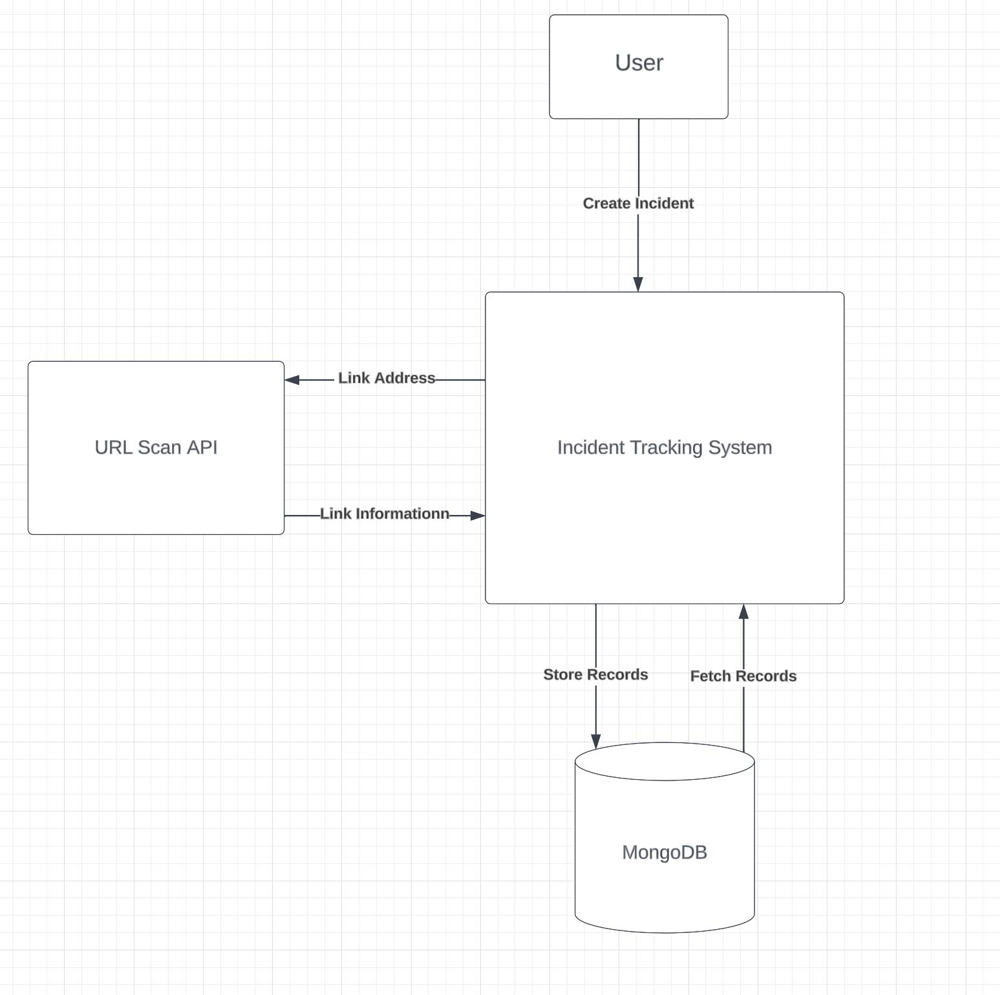

Architectural View
The diagram shows the flow of information for a person using the site. They will first see the home page,
then log in, then gain access to the main components of the site. From these components, they can create
incidents, view details about and add tasks to specific incidents, and view statistics to identify trends
across multiple incidents. The database provides inputs for viewing incidents and the statistics related to
them. External APIs such as URLscan.io provide input on the page to create incidents so the user can
view additional information about links or other threats.

Element Catalog
1. Homepage:
●
Responsibility: The homepage serves as the user interface entry point, providing options
for users to log in or create a new account.
2. Login:
●
Responsibility: The login component is responsible for authenticating users, ensuring
secure access to the system.
●
Significant Decisions: Separation of normal and super-user types to determine what
information is available
3. View Stats:
●
Responsibility: This component is responsible for presenting statistical information about
created incidents, offering insights into system performance or relevant metrics.
●
Significant Decisions: Used Chart JS
10

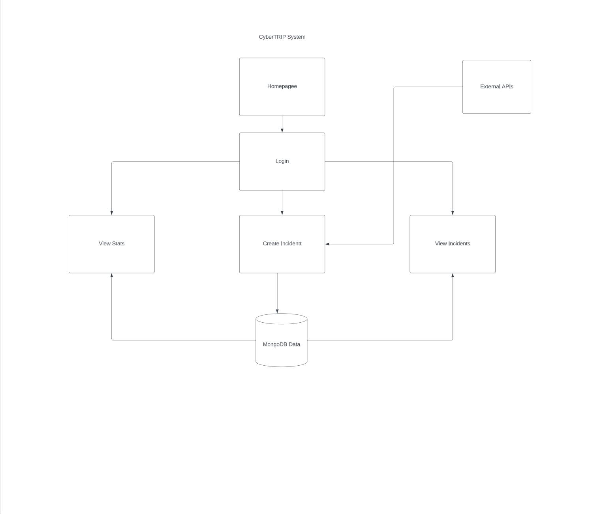

4. Create Incident:
●
Responsibility: The Create Incident component facilitates the generation of new incidents,
storing relevant data in MongoDB.
●
Significant Decisions: Originally users had to choose to store incidents in MongoDB but
the process was switched to automatic saving on the creation of a new incident for
prevention of accidental data loss. Incidents also needed to include enough information to
be searchable and easily sorted for statistics
5. View Incident:
●
Responsibility: This component allows users to retrieve and view information about
existing incidents, retrieving data from MongoDB.
●
Significant Decisions: This page needed to access routes to interact with mongoDB for
searching and deleting incidents
6. MongoDB:
●
Responsibility: MongoDB serves as the database element, storing and retrieving data
related to created incidents. Its responsibility includes efficient data management and
retrieval.
7. External API:
●
Responsibility: The External API component is responsible for interacting with external
services or systems, enabling the system to integrate and exchange information with
external entities.
●
Significant Decisions: Stored API key in environment variables for security and
implemented a timer to match with URL Scan.io’s security timer when making API calls,
URLs in the notes section of created incidents are automatically submitted to URL Scan
API.
4. Status
11

Home page

12

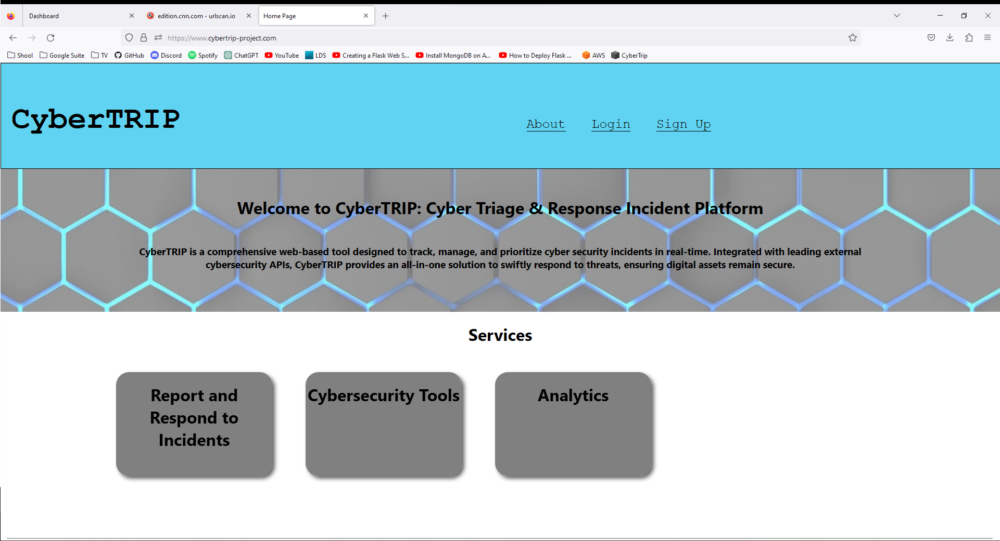
Sign Up
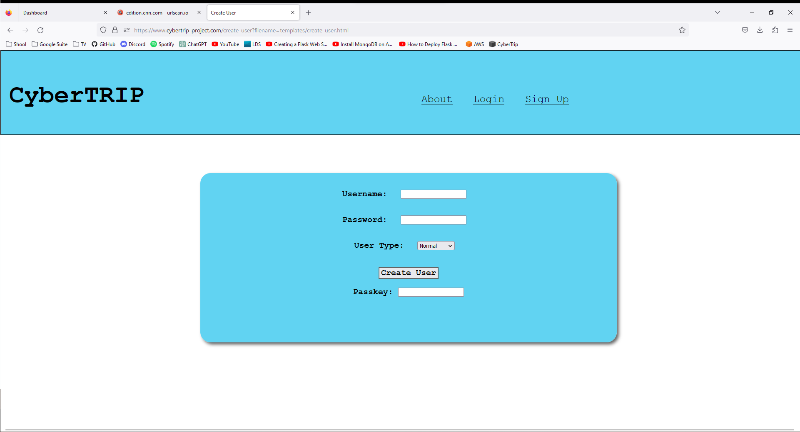
Login functionality
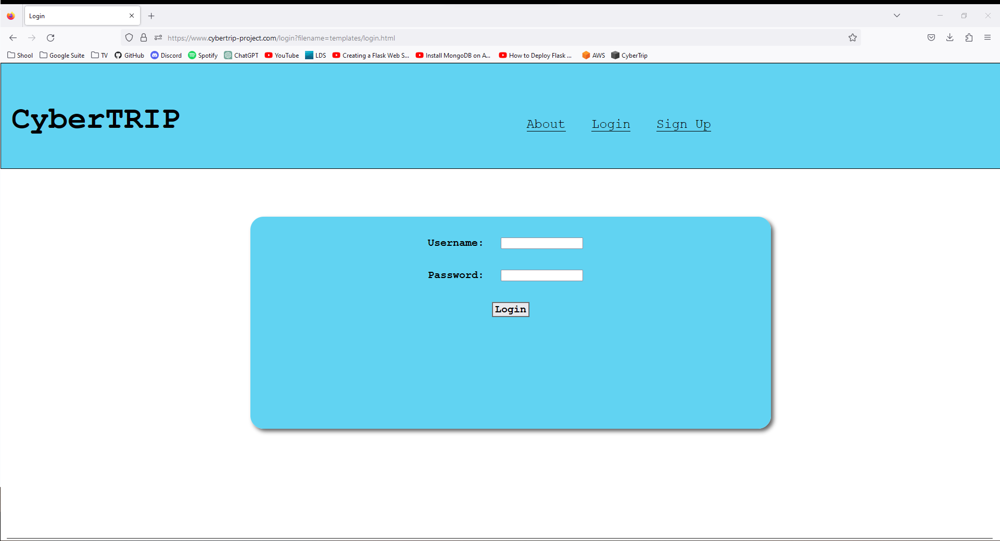

13
Creating an Incident
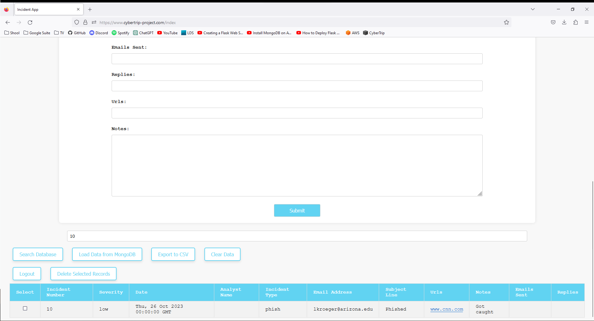
Url Scan API
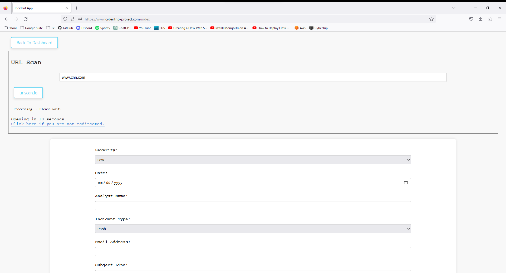
Viewing existing incidents
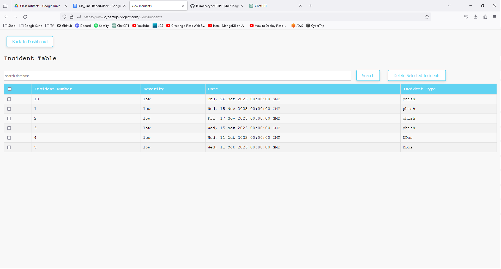

14
Search Incidents
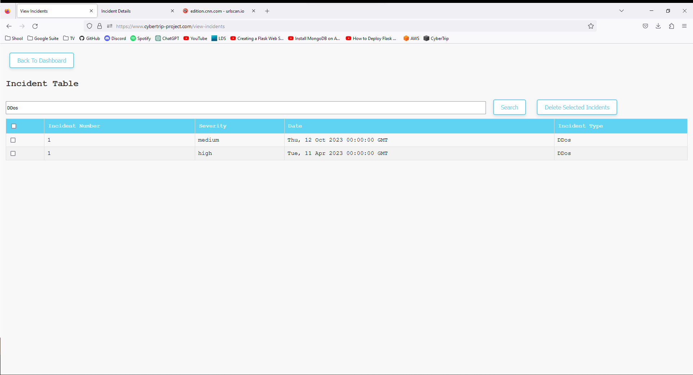

Delete Incidents
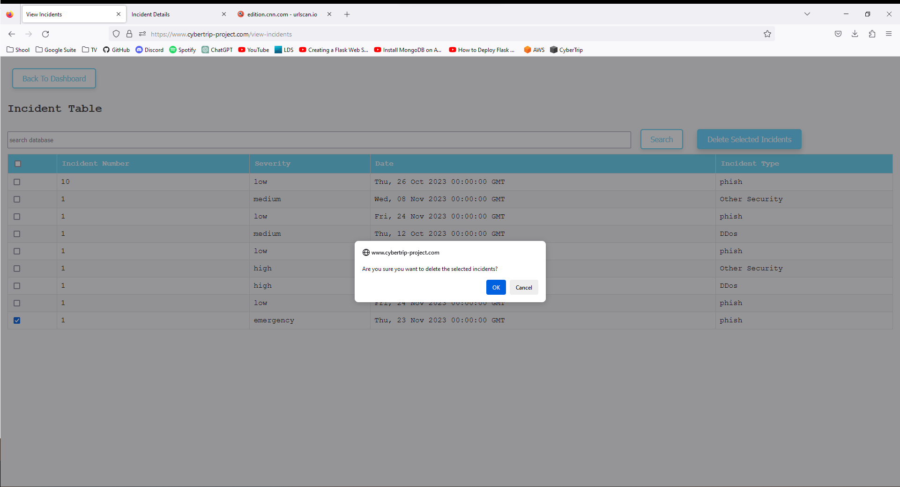

Add tasks

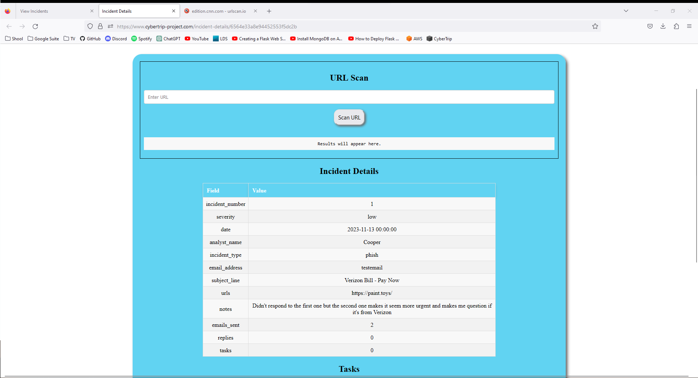
Edit Tasks

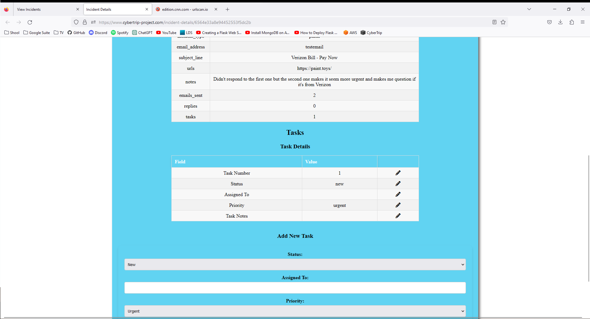
Viewing statistics

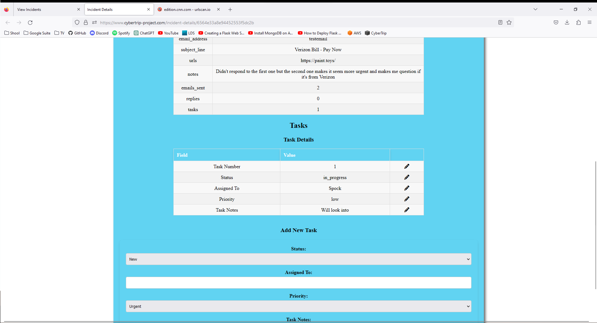

Logout
Architectural View
From the architectural view, the data from Create Incident is saving to the MongoDB. View Statistics
and View Incidents is correctly retrieving data from MongoDB. The External APIs are correctly
returning information to the user. Login is allowing the user to View Statistics, Create Incidents,
View Statistics, and interact with External APIs.

Tests Run
We have run all of our Acceptance tests as well as other tests such as multiple users on the website at
once.

Lines of Code Written

16
15
View Individual Incidents
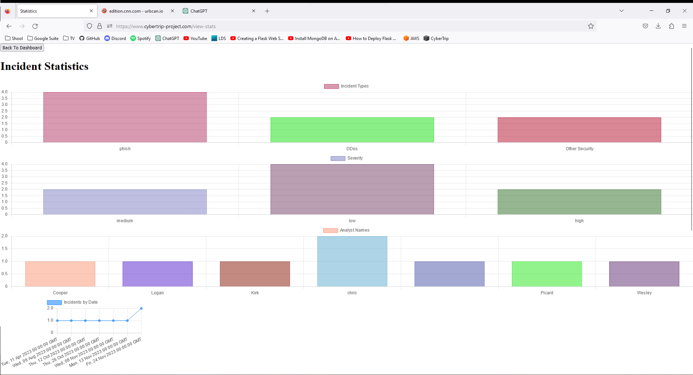

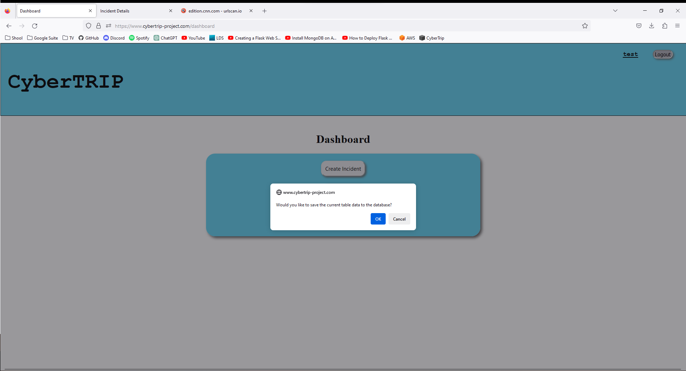

1722 html files
866 css files
775 python
3363 lines guaranteed. Possibly closer to 3500 with other files needed to deploy the website in
production on the EC2 instance.
5. Teamwork
At the beginning stages of this project we were operating with a very loose process model and
workflows and essentially just decided on general work items then worked towards completing them for
a single iteration. However, as we progressed we managed to make significant improvements in our
workflow and collaboration by formalizing work logs with specific tasks assigned to each member,
which made working through the project much easier when it came time to debug, test, and integrate our
code with one another’s. We also continued to meet weekly on Thursdays from 12pm - 1pm where we
would discuss the work that has been completed, the work in progress, and the tasks that need to be
completed. We also continued to utilize our GitHub repository as a means of sharing and merging code,
and a Discord group chat as our primary means of communication.
The roles of each team member for this iteration were as follows: Chris – Product Owner &
Backend Developer, Logan – Backend Developer, Cooper – Scrum Master & Frontend Developer, and
Katelen – Frontend Developer. In the first iteration, Chris was vital in developing work items and the
foundation of the entire project. He developed a working backend prototype for the essential functions of
the web application (login/logout, creating users, connecting to database, submitting incidents, viewing
incidents, and implementing a preliminary cybersecurity API). In the second iteration, Chris’s
contribution was the implementation of a feature that allows analysts to create items, or “tasks”, detailing
what is being done for a particular case as well as other notes. This feature was also useful for users to
see what is being done to resolve an issue/case. Chris also worked to update previously implemented
features with new functionality, such as adding a timer to the URL scanner to wait until results are ready
and then redirect, and creating links in incident reports that can be clicked on and automatically run the
URL scanner. Since the end of the second iteration, he has continued to update features by making tasks
editable, and storing deleted incidents in a temporary delete space where they can be recovered.
Throughout the course of the project, Logan has assisted in the development of all backend
functionality, and also has been integral to creating and maintaining the documentation (i.e. worklogs,
meeting notes, documentation of contributions, etc.) necessary to remain organized not only as a team,
but as developers. He is also the person responsible for hosting our web application on an AWS system
with its own domain name, and has been the primary developer maintaining and updating the live web
application by integrating new features to the application on the AWS system and debugging issues that
have arisen while hosting the web application.
17

Cooper and Katelen have worked on the front end of the web application by developing integral
aspects of the user interface (e.g. a page to view and filter through incident reports, a user dashboard, a
home page, etc.), organizing any existing backend material, arranging the web application to provide an
intuitive user experience, and ensuring that the front and backend of the web application work together
seamlessly. It has been their primary job to ensure the uniformity and consistency of the application,
while also making the data provided on the site easily readable.
Overall, with this arrangement, the amount of work each team member contributed was roughly:
Chris - 28%, Cooper - 24%, Logan - 26%, and Katelen - 22%. The tasks and responsibilities were
distributed in a way that allowed our team to use individual strengths and skills effectively while
maintaining a collaborative approach to our project's challenges.
6. Project Management
Top 5 Items from the Change Log
One of our bigger decisions centered around the different user types. Though we ran out of time to
properly implement the different user types we had planned out, we spent much of our meetings
discussing how the different user types should work, what the different user types would be,
permissions, etc. We ended up with three different kinds of users: superuser which had all power and
permissions in the website, Supervisors which would manage incidents and tasks, and standard users
which could view their associated incidents and their status.
Another decision was how we would scale the website with the database. We were able to use
MongoDB locally when testing the website locally and we got it running locally on the website
server to allow basic functionality for the website. We discussed trying to make MongoDB Atlas
work with the server so that we would be able to offload the data storage to Mongo instead of a local
version on the server. However, given time and work constraints, we decided to leave the website
using the local version instead of attempting to get it to work with Atlas.
One major event was figuring out the best way to store the API key for the URL Scanner. There
wasn’t much discussion about what the best way should be but more determine what ways it could be
done safely. Chris eventually settled on saving it as an environment variable that would have to be
stored on the server.
One change we decided to add later in the project was adding tasks to incidents. It seemed intuitive
and useful so there wasn’t much debate on whether or not we would do it, just what the best way
would be to add it. We ended up deciding that the Tasks would only be viewable when the associated
Incident was individually viewed, which required implementing that feature.
18

Another smaller change that we all agreed on was adding a label displaying what user was logged in.
It was a simple few lines of code that improved the user experience by allowing the user to confirm
what account they were logged in as and that they were viewing the correct incidents associated with
the account.
7. Reflection and Continuous Improvement
What went well?
In the first iteration of our project, we were able to create several working prototypes that matched the
use cases we initially set in the planning stages of the iteration. We also developed several alternative
frontend GUI interfaces that worked in conjunction with the backend model. Our work process, team
coordination, and workflow was excellent which led to a working product fairly early. Overall, our
iteration goals were achieved and our meetings were well organized and documented. In the second
iteration, some things that went well were that we were able to set up more well defined work items, and
implement many new features such as a statistics page, creation of case tasks, UI interface uniformity,
making incidents deletable, and automatically running URL scan for incidents when a link is clicked on
an incident report. Hosting the website on AWS has been immensely successful, despite a few issues
which were quickly, and effectively resolved. Since our second status report something significant that
has gone well is that using the live web application with multiple users on the site at one time was
successful. Overall, our communication and collaboration throughout the project has gone very smoothly,
and has been a critical component of our successes.
What didn’t go well?
In the first iteration, task definition was not as formally defined as it could have been. We also
encountered privacy issues with our API key being publicly visible. Additionally, it took more time than
expected to port our program to the cloud. In the second iteration, there was a delay in development
because of the time it took to figure out that we had to serialize the data from the MongoDB database in
order to retrieve said data. Although we were still able to accomplish the goals we had set forth for that
iteration, we did have less time for other tasks as a result. Additionally, during the second iteration we
found that unfortunately the API key did not work with env vars.
It is worth noting that the issues we came across during our first and second iteration were completely
resolved. On the other hand, we have come across a few more things since our second status report that
did not go well. First off, we were not able to add more external APIs due to time constraints caused by
debugging issues while hosting the live web application with AWS. Secondly, we have found that for
some reason the info cards on the about page work fine on the live AWS version of our application, but
fail when tested locally. Additionally, we were also unable to implement a supervisor user type like we
had initially planned due to time constraints.
What advice do you have for future teams?
19

Our advice for future teams would be to utilize a visual design tool to help with planning the
layout/functionality of application in the early stages of development, and to plan more modularly, being
sure to really think through the interactions between modules and how data is stored across different
tools. Based on our own experience, we would also recommend thoroughly thinking about what kind of
security and encryption are necessary for your project before starting rather than after, as it will be much
harder to implement later in the development process.
20
